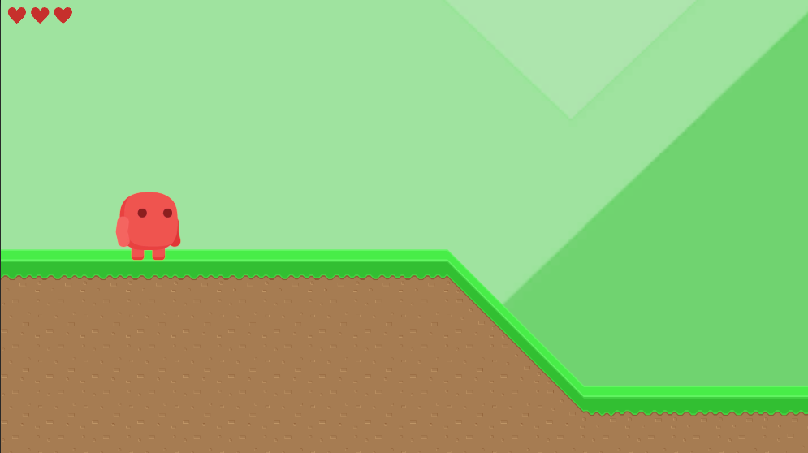

# Nome do Jogo 2D

## Sobre o Jogo
Jogo de plataforma implementando os seguitnes requisitos:
* Tela inicial com opção de iniciar o jogo;
* Personagem principal com animações implementadas;
* Detecção e tratamento de colisão (via Unity ou manualmente);
* Presença de áudio e elementos de interface (HUD);
* Controle de câmera:
* Objetivo a ser alcançado:

## Como Jogar
- Descreva as mecânicas do jogo.
- Explique os controles, por exemplo, como mover o personagem, atacar, usar itens, etc..

## Objetivo do Jogo
- O objetivo do jogo é encontrar o baú escondido pelo mapa, passando por vários desafios de pulo e inimigos.

## Créditos de Assets
- [Free Platform Game Assets] (https://assetstore.unity.com/packages/2d/environments/free-platform-game-assets-85838)

## Desenvolvedores
- Frederico Dôndici
- Lucas Henrique Cardoso
- Pedro Lucas Botelho

